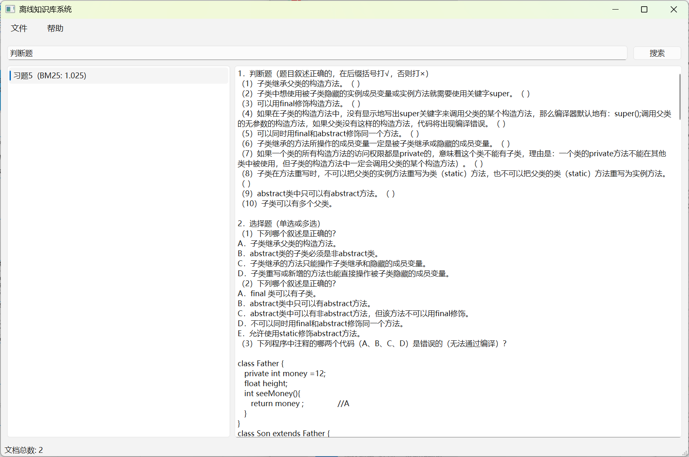
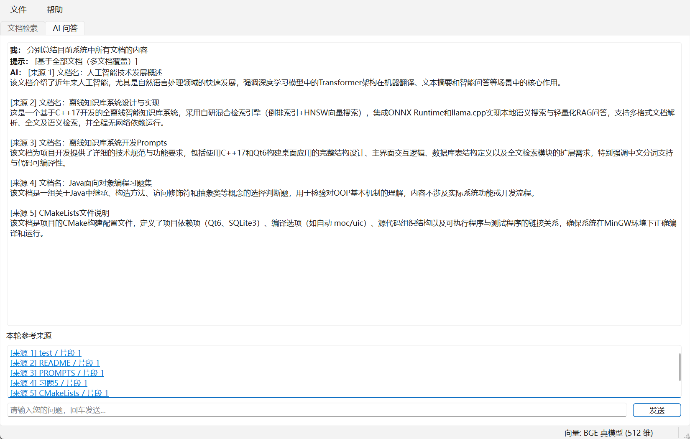

# OfflineKB

全离线的桌面知识库与 RAG 问答系统。导入 TXT/Markdown 文档后，可在本地完成检索、语义搜索和带来源引用的 AI 问答，无需联网或调用云端 API。




## 特性

- **文档管理**：导入 `.txt` / `.md`，持久化到 SQLite
- **中文检索**：cppjieba 分词 + BM25 关键词搜索
- **语义检索**：BGE embedding（GGUF）+ HNSW 向量索引
- **混合召回 RAG**：BM25 与向量检索 RRF 融合，再交给本地 LLM 生成回答
- **来源追溯**：每条回答展示引用片段，可跳转至原文
- **文档聚焦**：选中某篇文档后，问答优先基于该文档
- **MCP 支持**（可选）：通过 `offlinekb-cli` 暴露为 Agent Tool，供 Cursor 等客户端调用

## 技术栈

C++17 · Qt 6 · SQLite · cppjieba · hnswlib · llama.cpp · GGUF

## 环境要求

- **操作系统**：Windows（推荐 MSYS2 MinGW 64-bit 环境编译）
- **编译工具**：GCC、CMake、Ninja
- **依赖库**：Qt 6、SQLite3
- **可选**：Vulkan（GPU 推理加速）
- **模型文件**：需自行下载 GGUF，见下文

## 快速开始

### 1. 克隆仓库

```bash
git clone --recursive https://github.com/liliyliliy/OfflineKB.git
cd OfflineKB
```

若子模块未拉取：

```bash
git submodule update --init --recursive
```

`llama.cpp` 体积较大，未包含在仓库中，需单独克隆：

```bash
git clone --depth 1 https://github.com/ggml-org/llama.cpp.git third_party/llama.cpp
```

### 2. 安装依赖（MSYS2 MinGW64）

```bash
pacman -Syu
pacman -S --needed \
  mingw-w64-x86_64-gcc \
  mingw-w64-x86_64-cmake \
  mingw-w64-x86_64-ninja \
  mingw-w64-x86_64-qt6-base \
  mingw-w64-x86_64-sqlite3
```

启用 Vulkan 加速时，额外安装：

```bash
pacman -S --needed \
  mingw-w64-x86_64-vulkan-headers \
  mingw-w64-x86_64-vulkan-loader
```

### 3. 准备模型

将 GGUF 模型放入 `models/` 目录（或编译后的 `build/models/`）：

| 用途 | 推荐模型 | 文件名示例 |
|------|----------|------------|
| 生成 | Qwen3-4B-Instruct | `Qwen3-4B-Instruct-2507-Q4_K_M.gguf` |
| 向量 | BGE 中文 small | `bge-small-zh-v1.5-q4_k_m.gguf` |

> 未找到 embedding 模型时会回退到哈希向量，语义检索效果显著下降。可在菜单 **帮助 → 当前模型状态** 中确认是否加载了 BGE。

### 4. 编译与运行

在 MSYS2 MinGW 64-bit 终端中：

```bash
cmake -B build -G Ninja -DCMAKE_PREFIX_PATH="$MINGW_PREFIX"
cmake --build build --parallel
./build/OfflineKB.exe
```

纯 CPU 编译（关闭 Vulkan）：

```bash
cmake -B build -G Ninja \
  -DCMAKE_PREFIX_PATH="$MINGW_PREFIX" \
  -DOFFLINEKB_USE_VULKAN=OFF
cmake --build build --parallel
```

## 使用说明

1. 启动 `OfflineKB.exe`
2. 在 **文档检索** 页导入 TXT 或 Markdown 文件
3. 使用关键词或语义搜索浏览文档
4. 切换到 **AI 问答** 页提问
5. 查看回答下方的 **引用来源**，点击可定位到原文片段

针对某篇文档提问时，可先在检索页选中该文档，或在问题中写出文档名。

## 项目结构

```text
OfflineKB/
├── include/          # 头文件
├── src/              # GUI 与核心逻辑
├── tools/            # offlinekb-cli（无 GUI 的 JSON 服务）
├── mcp/              # Python MCP Server（可选）
├── tests/            # 测试与评测
├── resources/dict/   # cppjieba 词典
├── third_party/      # cppjieba、hnswlib、llama.cpp（需自行克隆）
└── models/           # GGUF 模型目录（需自行下载，不上传 Git）
```

## RAG 流程概览

```text
导入文档 → 分块 → BM25 索引 + 向量索引 → 用户提问
    → 混合召回（BM25 + HNSW + RRF）→ 拼接上下文 → 本地 LLM 生成 → 展示来源
```

## MCP 集成（可选）

若希望 Cursor 等 Agent 调用本地知识库：

```text
Cursor → mcp/server.py → offlinekb-cli → KbService
```

```bash
cmake --build build --target offlinekb-cli
pip install -r mcp/requirements.txt
```

配置与联调说明见 [mcp/README.md](mcp/README.md)。

可用 Tool：`list_documents`、`search_kb`、`ask_rag`、`get_chunk`

## 测试

```bash
# 关键词检索 smoke test
./build/test_search.exe

# 检索质量回归（不加载 LLM）
./build/eval_retrieval.exe --dict-dir resources/dict --models-dir models
```

## 常见问题

**找不到模型**  
确认 GGUF 文件已放入 `models/` 或 `build/models/`，文件名与程序搜索的名称一致。

**语义搜索效果差**  
检查是否加载了 BGE embedding 模型，而非哈希回退模式。

**没有 GPU 加速**  
确认已安装 Vulkan 相关依赖，且 CMake 未加 `-DOFFLINEKB_USE_VULKAN=OFF`。

**更换 embedding 模型后检索异常**  
删除应用数据目录下的 `chunks.hnsw` 与 `chunks.meta.json`，重启后会自动重建索引。

## License

本项目仅供学习与交流。第三方依赖（llama.cpp、cppjieba、hnswlib 等）请遵循各自的开源协议。GGUF 模型请遵循对应模型的 License。
